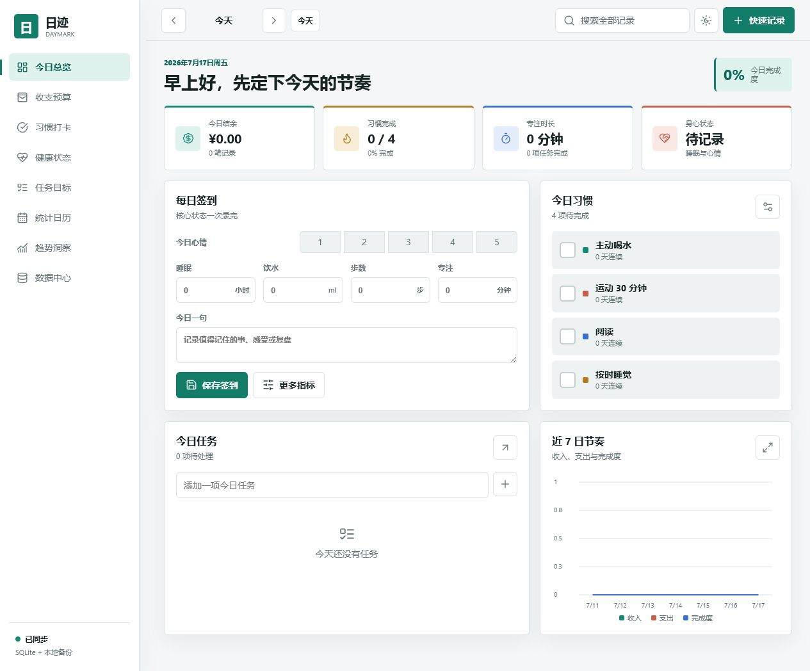
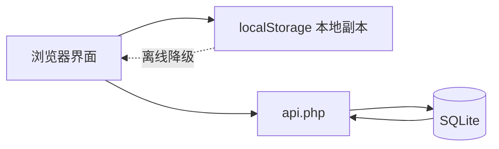

# 日迹 Daymark

日迹是一个本地优先、无需构建工具的个人每日统计面板。它把收支、习惯、健康、任务、目标、日记和趋势放在同一个界面中，并通过浏览器本地存储与 PHP/SQLite 双重保存数据。



[](LICENSE)
[](https://www.php.net/)
[](https://www.sqlite.org/)
[](https://github.com/843551508/daymark-daily-tracker/actions/workflows/ci.yml)

## 功能

| 模块 | 能力 |
| --- | --- |
| 今日总览 | 完成度、每日签到、当日收支、习惯、任务、近 7 日节奏 |
| 收支预算 | 收支 CRUD、自然语言批量记账、分类预算、月度趋势、CSV 导出 |
| 习惯打卡 | 周视图、连续天数、目标与颜色管理 |
| 健康状态 | 睡眠、体重、步数、饮水、运动、专注、屏幕时间、精力、压力 |
| 自定义指标 | 热量、血压、用药、阅读页数等任意数字指标 |
| 任务目标 | 日期、优先级、完成状态、量化目标与里程碑 |
| 统计日历 | 按日聚合收支、习惯、任务、心情与日记 |
| 趋势洞察 | 完成度、睡眠心情关联、消费分类与周期对比 |
| 数据中心 | JSON 完整备份、合并导入、每日汇总 CSV、偏好设置 |

全站还支持全局搜索、明暗主题、桌面和手机响应式布局、离线降级及旧版 FinFlow 收支迁移。

## 快速开始

### 方式一：直接打开

直接打开 `index.html` 即可使用。此模式仅使用浏览器 `localStorage`，适合单机体验和无需服务器的场景。

### 方式二：PHP + SQLite

需要 PHP 7.4+ 与 `sqlite3` 扩展：

```powershell
php -d extension=sqlite3 -S 127.0.0.1:8787
```

打开 [http://127.0.0.1:8787/](http://127.0.0.1:8787/)。首次请求会自动创建 `data/daymark.db`。

部署后可访问 `/test.html` 检查 PHP、SQLite、状态读写和兼容接口。

### 方式三：Docker

```bash
docker compose up -d --build
```

打开 [http://127.0.0.1:8787/](http://127.0.0.1:8787/)。数据保存在 Docker named volume `daymark_data` 中。

## 文档

- [完整使用教程](docs/USER_GUIDE.md)
- [部署、升级与备份](docs/DEPLOYMENT.md)
- [安全说明](SECURITY.md)
- [参与贡献](CONTRIBUTING.md)

## 数据策略



- 每次修改先写入浏览器本地存储，服务器在线时再同步 SQLite。
- 如果已有旧版 `data/finflow.db`，新后端会继续使用它。
- 原版 `records` 表和 `/api/records` 接口保留，旧收支可自动迁移。
- 清空数据前会自动下载 JSON 备份。
- `data/*.db`、临时 WAL 文件和本地工作记录均被 `.gitignore` 排除。

## 项目结构

```text
.
├─ index.html                 主界面
├─ api.php                    PHP/SQLite API
├─ test.html                  部署自检页面
├─ assets/
│  ├─ app.css                 响应式视觉系统
│  ├─ app.js                  全部前端业务逻辑
│  └─ vendor/                 本地图标依赖
├─ docs/
│  ├─ USER_GUIDE.md           使用教程
│  ├─ DEPLOYMENT.md           部署与运维
│  └─ images/                 文档图片
├─ Dockerfile
└─ docker-compose.yml
```

## 技术特点

- 无 npm、无打包步骤、无框架锁定
- 原生 HTML/CSS/JavaScript，图标依赖已本地化
- PHP 单文件 API，SQLite 自动建表和迁移
- JSON 状态同步与旧收支 CRUD 双接口
- 桌面与移动端自适应，Canvas 原生绘图
- 导入内容转义、请求体限制、事务写入和参数化 SQL

## 本地检查

```powershell
node --check assets/app.js
php -l api.php
```

浏览器验收覆盖 1280px 桌面和 390px 手机视口，包括签到、收支、习惯、任务、目标、日历、刷新恢复、Canvas 渲染和控制台错误检查。

## 设计参考

功能模型参考了以下开源项目，代码与界面均为独立实现：

- [Actual Budget](https://github.com/actualbudget/actual)：local-first 财务与预算
- [Nomie](https://github.com/open-nomie/nomie6-oss)：自定义 tracker 和个人数据所有权
- [Loop Habit Tracker](https://github.com/iSoron/uhabits)：习惯 streak 与周视图
- [ActivityWatch](https://github.com/ActivityWatch/activitywatch)：时间趋势和本地隐私
- [Flow Dashboard](https://github.com/onejgordon/flow-dashboard)：任务、习惯和目标统一面板

## License

[MIT](LICENSE) © 2026 843551508
